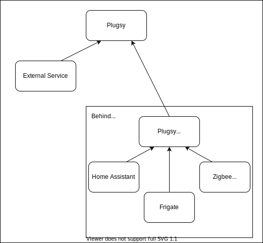

# Agent Mode
### Description

Plugsy now supports agent mode, allowing you to push changes from 1 plugsy container to another. 

This is useful should you have multiple docker/connected environments that you'd like to monitor from a single dashboard.

We now also have a separate deployable image containing only the agent side of plugsy (Also working on ARMv7) 


#### Example use case



### Using the plugsy agent image

Super simple if your plugsy core is open using the following environment variables and docker-compose

**Note:** You will have to input the GraphQL endpoint for the plugsy container which is currently at `/graphql`

docker-compose.yml
```yml
  plugsy-agent:
    container_name: plugsy-agent
    image: plugsy/agent
    environment:
      - PLUGSY_AGENT_ENDPOINT="http://myplugsyinstance:3000/graphql"
    volumes:
      - /var/run/docker.sock:/var/run/docker.sock
```

If you have a more complicated request method (Using proxies, etc...)
You can mount a config.json much like the plugsy/core:

docker-compose.yml
```yml
  plugsy-agent:
    container_name: plugsy-agent
    image: plugsy/agent
    volumes:
      - /var/run/docker.sock:/var/run/docker.sock
      - ./config.json:/config.json
```

config.json
```json
{
  "$schema": "https://github.com/plugsy/core/releases/download/v6.0.0-beta.1/agent-config-schema.json",
  "agent": {
    "endpoint": "http://localhost:3000/graphql",
    "clientConfig": {
      "headers": {
        "Authorization": "Bearer ***"
      }
    }
  }
}
```

**Note**: `clientConfig` is optional, if you need more complex client config, you can use the following type:

```ts
export interface RequestInit {
    body?: BodyInit | null;
    cache?: RequestCache;
    credentials?: RequestCredentials;
    headers?: HeadersInit;
    integrity?: string;
    keepalive?: boolean;
    method?: string;
    mode?: RequestMode;
    redirect?: RequestRedirect;
    referrer?: string;
    referrerPolicy?: ReferrerPolicy;
    signal?: AbortSignal | null;
    timeout?: number;
    window?: any;
    fetch?: any;
}
```

### How to enable in plugsy/core

Simply add the agent section to your configuration file with the location of your other plugsy node.

**Note:** You will have to input the GraphQL endpoint for the plugsy container which is currently at `/graphql`

```jsonc
{
  "$schema": "https://github.com/plugsy/core/releases/download/v6.0.0-beta.1/core-config-schema.json",
  "agent": {
    "endpoint": "http://localhost:3000/graphql"
  }
}
```


