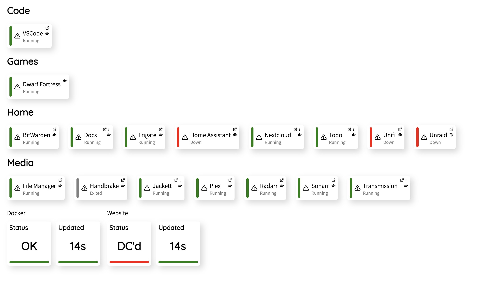
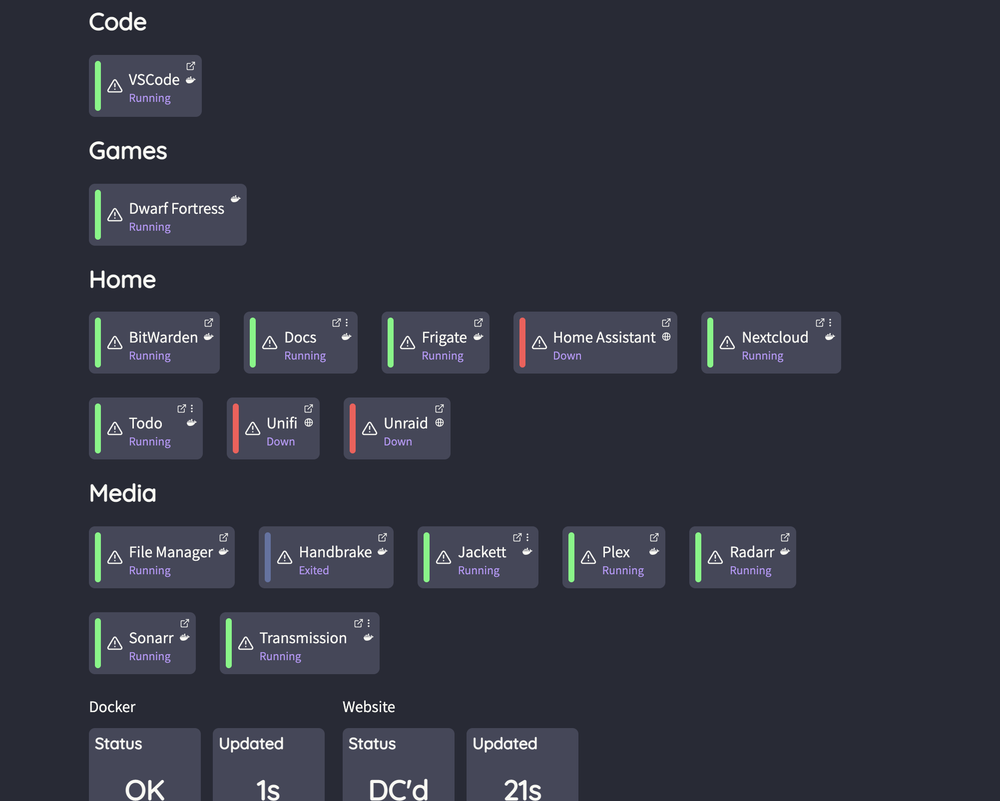

# Theming

Theming is available as of v4.0.0, this is done using the config file.

Every component used in Plugsy can have its CSS overidden in the config file, this can happen without needing a reload, simply edit your config file and watch plugsy change!

**Note**: It is highly recommended to use an IDE and the `$schema` key in your json config file as the nested components can be quite difficult to work out.

# Examples

## Allow more items on your screen

Good for use on a TV

### Example



### Config File

```jsonc
{
  "$schema": "https://github.com/plugsy/core/releases/download/v4.0.0/core-config-schema.json",
  "loggingLevel": "verbose",
  "theme": {
    "pages": {
      "Home": {
        "HomeContainer": {
          "maxWidth": 1500
        }
      }
    }
  }
}
```

## Dracula Theme Example

This can be used as a base for a dark mode.

### Example



### Config File

```jsonc
{
  "$schema": "https://github.com/plugsy/core/releases/download/v4.0.0/core-config-schema.json",
  "theme": {
    "colors": {
      "GREEN": "#50fa7b",
      "RED": "#ff5555",
      "YELLOW": "#f1fa8c",
      "GREY": "#6272a4"
    },
    "components": {
      "Category": {
        "Title": {
          "color": "#f8f8f2"
        }
      },
      "Item": {
        "Small": {
          "color": "#bd93f9"
        },
        "Text": {
          "color": "#f8f8f2"
        },
        "Container": {
          "background": "#44475a",
          "boxShadow": "none"
        },
        "PopoverContainer": {
          "background": "#44475a",
          "boxShadow": "none"
        },
        "Separator": {
          "backgroundColor": "#282a36"
        },
        "Muted": {
          "color": "#6272a4"
        },
        "Icon": {
          "color": "#f8f8f2"
        },
        "ExternalLinkContainer": {
          "color": "#f8f8f2"
        },
        "ExternalLinkContainerColumn": {
          "color": "#f8f8f2"
        }
      },
      "StatusBox": {
        "Container": {
          "background": "#44475a",
          "boxShadow": "none"
        },
        "Text": {
          "color": "#f8f8f2"
        },
        "Title": {
          "color": "#f8f8f2"
        }
      },
      "ConnectionStatus": {
        "ConnectionStatusId": {
          "color": "#f8f8f2"
        }
      }
    },
    "pages": {
      "Home": {
        "AppContainer": {
          "background": "#282a36"
        }
      }
    }
  }
}
```
